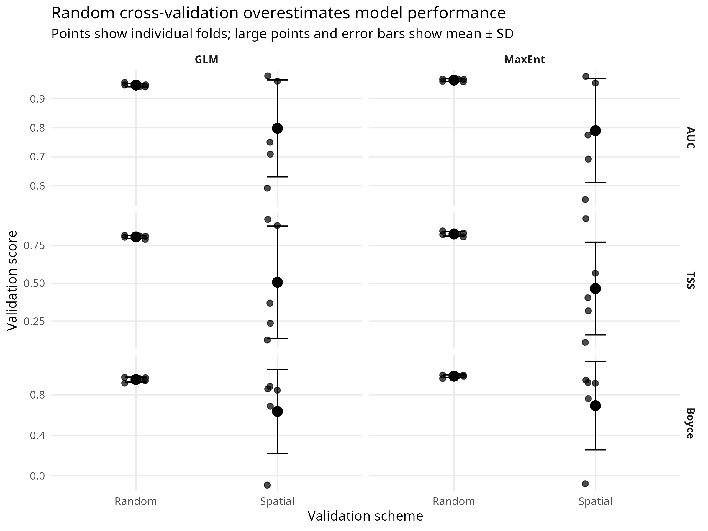
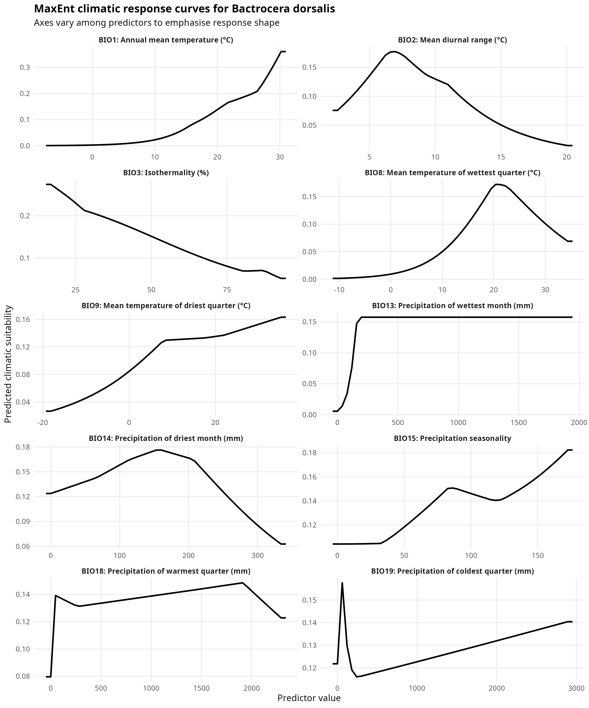
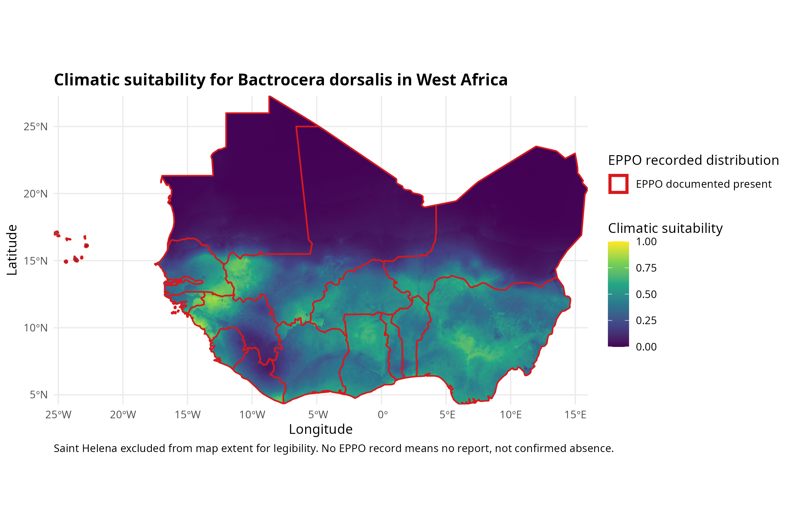
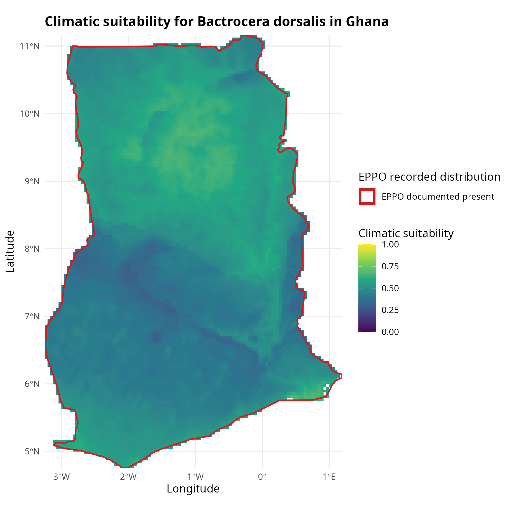

```{r}
#| label: setup
library(here)
library(readr)
library(dplyr)
library(knitr)

validation_table <- read_csv(
  here("outputs", "tables", "validation_metric_table.csv"),
  show_col_types = FALSE
)

contribution_table <- read_csv(
  here("outputs", "tables", "maxent_variable_contribution.csv"),
  show_col_types = FALSE
)

cleaning_log <- read_csv(
  here("data", "processed", "cleaning_log.csv"),
  show_col_types = FALSE
)
```

## Summary {.unnumbered}

*Bactrocera dorsalis* was first detected in Africa in 2003 and had reached 35 sub-Saharan
countries within fifteen years [@mutamiswa2021]. It is a regulated quarantine pest in the
markets West African horticulture sells into, and its recorded distribution is now dense enough
to model.

This report fits a climatic suitability model for the species across West Africa from 1,089
cleaned public occurrence records, and then does the thing that is usually left out. The same
model is scored under conventional random cross-validation and under folds separated in space.
Apparent performance falls from an AUC of 0.964 to 0.790, and TSS from 0.826 to 0.465. The
standard deviation across folds grows by roughly a factor of thirty.

If a model still works well when tested on new geographic areas, it actually understands the climate patterns. If it fails on new areas, it just memorized the map of where scientists prefer to look for bugs.

## What this model is, and is not

This is a model of where climate resembles the climate at places where someone recorded this
insect and uploaded the record. GBIF is a convenience sample, and recording effort follows
funded projects, road networks and institutional interest [@zizka2019]. The target-group
background used here reduces that distortion [@phillips2009] but does not remove it.

A climate-only model omits host availability, irrigation, trade pathways, natural enemies and
management, all of which decide whether a climatically suitable place is actually infested.
MaxEnt output is a relative suitability index, not a probability of presence [@elith2011], and
thresholding it into a binary map imposes a decision the model does not contain.

Absence of records from a country is not absence of the pest. That asymmetry falls hardest on
the countries with the least surveillance capacity, which is exactly where a suitability map
would be most useful.

## Question

First, which climatic variables separate the localities where *B. dorsalis* has been recorded
from the wider background, and what does the resulting suitability surface look like over West
Africa and over Ghana?

Second, when the model is validated on spatially separated blocks rather than randomly
held-out points, so that it can no longer score itself on the neighbourhood it was trained in,
how far does its apparent performance fall?

## Data

### Occurrence records

Records were retrieved through the GBIF download API, which mints a citable DOI for each query.
The *B. dorsalis* download returned 11,757 georeferenced records with no flagged geospatial
issue (DOI 10.15468/dl.jzyuk9). A second download returned 328,343 Tephritidae records
excluding *B. dorsalis* (DOI 10.15468/dl.g9edqf), used later to build the background.

Taxonomy is an important factor here. *B. invadens*, the name under which the African invasion was first
described, was synonymised with *B. dorsalis* in 2015 [@schutze2015]. Records filed under both
names resolve to the same GBIF taxon key, so the African records are not lost.

### Predictors

Nineteen bioclimatic variables from WorldClim v2.1 at 2.5 arc-minutes [@fick2017]. That
resolution is roughly 4.5 km at the equator, which is finer than the occurrence data can
support once thinned, and coarse enough to keep the prediction step to seconds.

### Cleaning

```{r}
#| label: tbl-cleaning
#| tbl-cap: "Records retained at each cleaning stage."
kable(cleaning_log, col.names = c("Stage", "Records"), format.args = list(big.mark = ","))
```

Five CoordinateCleaner tests were applied: administrative centroids, identical latitude and
longitude, the GBIF office in Copenhagen, biodiversity institution addresses, and exact zeros
[@zizka2019]. These flagged 35 centroids and 16 institutions, three records being caught by
both, for a loss of 48.

Two tests were deliberately not used as deletion criteria. The capital-city test flagged 433
records, most of them plausible urban observations of a pest that thrives in backyard fruit
trees. The sea test proved highly sensitive to coastline resolution. Neither is specific enough
to delete on, so whether a location could enter a climatic model was settled instead by whether
WorldClim returned a value for it. That removed a further 146 records.

Exact-coordinate duplicates were not filtered separately. 856 coordinates carried repeated
records, 10,343 records in total, one coordinate holding 351. Thinning to one record per
WorldClim cell handles both exact repeats and distinct coordinates carrying identical climate
values, which left 1,089 presences.

The Tephritidae background passed through the same five tests, 328,343 down to 324,912, and the
same cell-level thinning. Presences and background have to be cleaned identically, or a
difference the model finds between them could be an artefact of the cleaning.

### The stopping rule

A checkpoint was set before fitting began: if the cleaned African records occupied fewer than
about 25 distinct 100 km cells, the model would be describing a few field campaigns rather than
a climate envelope, and the species would be switched to *Spodoptera frugiperda*.

75 cleaned African records fell in 75 distinct 100 km cells. The threshold was cleared.

The sparseness is still worth stating plainly. 75 African records, after cleaning, for a pest
established across 35 countries. The model is therefore fitted on the global record and
projected onto West Africa, rather than fitted on African records alone.

## Method

### Predictor screening

Variables were dropped one at a time by variance inflation factor until every remaining
variable fell below a VIF of 10. Ten survived: BIO1, BIO2, BIO3, BIO8, BIO9, BIO13, BIO14,
BIO15, BIO18 and BIO19.

Screening was run on the West African stack rather than the global one. Collinearity between
bioclimatic variables is regional, and two variables that separate cleanly worldwide can be
near-identical across West Africa alone. Screening globally would have retained variables that
are redundant in the area being predicted.

### Background

10,000 background points were drawn from the recorded locations of other Tephritidae, excluding
any cell holding a *B. dorsalis* presence.

The reasoning is the target-group argument [@phillips2009]. Fruit flies are collected by the
same traps, in the same orchards, by the same people. Where other Tephritidae were recorded is
therefore an approximation of where anyone was looking. Drawing background from those locations
means the model is asked to separate presences from other surveyed places, rather than from
unsurveyed wilderness. A uniform random background would have handed the model a map of survey
effort and allowed it to report the result as climate.

Cells holding a presence were excluded from the background to avoid putting the same cell on
both sides of the response.

### Models

MaxEnt [@phillips2006; @elith2011] and a ridge-penalised logistic regression were both fitted.
Ridge instead of lasso, because the retained predictors remain correlated after VIF screening,
and ridge shrinks correlated coefficients together instead of arbitrarily selecting one.

Two algorithms were run so that the validation result could not be dismissed as a quirk of one
fitting procedure.

### Validation

Random five-fold cross-validation, stratified by response, provides the conventional baseline.
Spatially blocked five-fold cross-validation provides the contrast [@valavi2019].

Block size was taken from the empirical range of spatial autocorrelation in the predictors,
estimated by variogram. The blocked validation was then repeated at
half and double that size, because the estimated range is one number with uncertainty around
it.

Three metrics are reported: AUC, TSS [@allouche2006], and the continuous Boyce index
[@hirzel2006], the last being the one designed for presence-background.

Within every fold the classification threshold was taken from the training data at maximum
sensitivity plus specificity, then applied to the held-out data. Taking it from the test data
would let the threshold adapt to the answer and would conceal the effect being measured.

## Results

### The validation comparison

```{r}
#| label: tbl-validation
#| tbl-cap: "Cross-validation performance under random and spatially blocked folds. Mean and standard deviation across five folds. Drop is the random-fold mean minus the spatial-fold mean."
kable(validation_table)
```

{#fig-validation}

MaxEnt loses 0.174 AUC, 0.361 TSS and 0.291 Boyce when folds are separated in space. The GLM
loses 0.149, 0.300 and 0.315. Both algorithms fall by a similar amount, which is the useful
part of having run two: the optimism belongs to the validation design, not to MaxEnt.

The spread is equally as important as the mean. Under random folds the five MaxEnt AUCs sit between
0.958 and 0.968, a standard deviation of 0.005. Under blocked folds they run 0.977, 0.553,
0.692, 0.775 and 0.954, a standard deviation of 0.179. The model is excellent in some regions
and close to uninformative in others. Random cross-validation reports none of that, because
every fold contains near neighbours of its own training points, and a model only has to
interpolate between them to score well [@roberts2017].

An AUC of 0.553 on one blocked fold is not a failed run to be removed. It is a warning that the model has learned the map of where entomologists have been working, and that it cannot be trusted to extrapolate to new areas. The blocked validation is the one that should travel with the model if it is used to inform surveillance or phytosanitary decisions.

### Which predictors

```{r}
#| label: tbl-contribution
#| tbl-cap: "MaxEnt percent contribution by predictor."
kable(contribution_table)
```

{#fig-response}

Wettest-month precipitation and annual mean temperature together account for just over four
fifths of the contribution. That is consistent with the biology of a species that needs warmth
and moist fruiting seasons. It is equally consistent with sampling bias, because people and
their fruit trees also concentrate in warm, wet places, however, the two explanations cannot be
separated by this model.

Percent contribution in MaxEnt is heuristic and depends on the order variables entered the fit.
The table should be read as a ranking, not as a partition of explained variance.

### Suitability surfaces

{#fig-wa}

{#fig-ghana}

The regional surface separates the Sahelian north, which the model treats as unsuitable, from
the coastal and Guinea savanna belt running along the Gulf of Guinea. Within Ghana the pattern
is not a simple south-to-north gradient. The highest values fall in the mid-country belt around
the Black Volta and the Northern and Bono East areas, with a further pocket at the south-east
coast, while the forest zone in the south-west returns middling values.

The EPPO overlay is an external check. EPPO records reporting, not presence, so a country outlined as having no record is a country from which nobody has reported. Where the model predicts high suitability inside such a country, the map cannot distinguish a surveillance gap from a false positive. Read against the blocked-fold spread in @tbl-validation, that ambiguity should be taken seriously.

## Limitations

75 cleaned African records is thin for a continental projection. The model leans on the Asian native range for its climate envelope and assumes the invasive population occupies the same one, which is the standard assumption in
invasive-species modelling and is not always true.

The target group correction assumes Tephritidae recording effort resembles *B. dorsalis* recording effort. That is plausible and untested here.

**The block size assumption is testable and was tested.** Results at half and double the
estimated autocorrelation range are written to `data/processed/block_sensitivity_summary.csv`
by `03_analysis.R`.

**Nothing here says anything about the future.** No climate scenarios were run. Adding them
would multiply the output without addressing the uncertainty this report has already found in
the present-day fit.

## Conclusion

The suitability surface is unremarkable and broadly matches what is known about the species.
The validation comparison is what is noteworthy.

Reported the conventional way, this model has an AUC of 0.964 and would read as excellent.
Reported honestly, it has an AUC of 0.790 with a standard deviation of 0.179, and performs
close to chance in at least one region of the study area. Both numbers come from the same
model, the same data and the same code. Only the way the folds were drawn differs.

Species distribution models are among the most commonly submitted and most commonly
over-claimed analyses in applied ecology. Where such a model informs surveillance priorities or
phytosanitary decisions, the blocked figure is the one that should travel with it.

## Data and code availability

Occurrence data are archived at GBIF under DOIs 10.15468/dl.jzyuk9 and 10.15468/dl.g9edqf.
Climate data are WorldClim v2.1, CC BY-SA 4.0. Distribution records are from the EPPO Global
Database (taxon DACUDO). Analysis code and package versions are in the repository; see
`README.md` for the run order and for the reproducibility caveats.

## Software

Analysis in R 4.6.1. Occurrence retrieval with **rgbif**, cleaning with **CoordinateCleaner**
3.0.1 [@zizka2019], raster handling with **terra**, predictor download with **geodata**,
collinearity screening with **usdm**, modelling with **predicts** and **glmnet**, spatial
cross-validation with **blockCV** 3.2-0 [@valavi2019], the Boyce index with **modEvA**, and
figures with **ggplot2** and **sf**.

## References {.unnumbered}

::: {#refs}
:::
